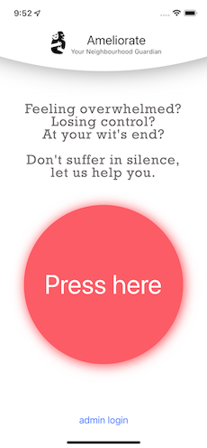
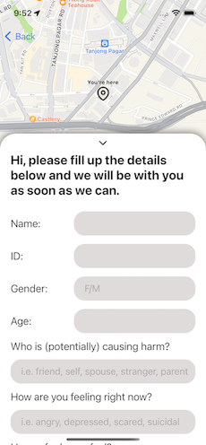
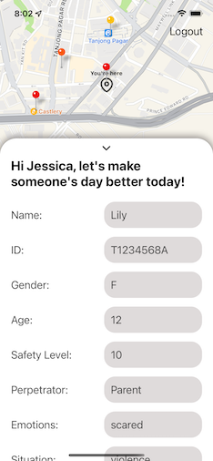

# GA Project 4 - MER(React Native)N Stack

# Ameliorate Application

## Background

This mobile app is motivated by the recent Greenridge Crescent incident, where a father was suspected (later arrested) to be involved in the death of his two 11-year-old sons with special needs.

Like how spiderman is known as your Friendly Neighborhood who protects people from villians, **Ameliorate** hopes to be your Neighborhood Guardian who will help you fight (yours or other's) inner demons or take care of your mental well-being.

## Description

**Ameliorate** aims to:

- allow people(user) who are at their most vulnerable moments of their life to reach out to someone who can help them at their finger tips
- users can submit (and edit) a form which will provide social workers(admins) with helpful details
- the app can track users' location in the foreground and background, any change in their locations will trigger an update to the database
- in any case where users decide that they do not require help any longer, they can cancel their requests
- an admin can see all the users on the map represented by location pins
- the location pins are color coded according to users' level of safety, which will allow social worker to quickly identify where help is of higher priority (red in color)
- upon successful rendering of help, the social worker can close the case with the 'close case' button and the particular user's pin will no longer be shown in the map

## Preview
This is the landing page 

This is the user's screen 

This is the social worker(admin)'s login screen 

This is the admin's screen 

## Backend
The backend files can be found in this [repository](https://github.com/yihuitham/GA-Project4-BackEnd)

## Technologies
List of technologies used:
- react
- expo, react native to build a mobile app
- expo-secure-store to tap into local storage of a mobile
- react-native-maps, expo-task-manager, expo-location to build the map component
- formik to submit/edit a form
- node.js
- express
- jwt
- mongoDB/mongoose

## Areas for futher development
- use socket io to send data from server to client,so as to provide admins automatic updates of new users or changes to existing users
- use of hand gesture to minimise or maximise modal
- provide visual indication on the location marker after it has been selected by admin
- a function to allow admin to indicate the case he/she will be attending to
- restrict admin to attend to only one case at a time
- grey out markers whose cases are being attended to by other admins
- a function to allow cerified social workers who are interested to be a part of Ameliorate to register
